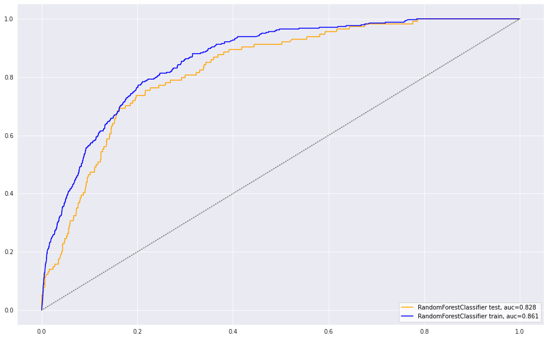

#  Kaggle Competition - Starter

## Problem Statement

In the past, Chicago has been hit by an outbreak of the West Nile Virus. The Data Science team at the Disease and Treatment Agency has been tasked by the Centers for Disease Control (CDC) to develop a strategy to deploy the effective use of targeted spraying to prevent future outbreaks.

Based on available data on features such as weather, location, mosquito species etc, we will build a binary classification model that predicts the presence of the West Nile Virus in the city of Chicago. The model that achieves the highest ROC AUC score on the validation set, will be selected as our production model. The model is also expected to outperform the baseline ROC AUC score of 0.5.

A cost-benefit analysis will also be done to determine if the benefits of spraying outweighs its costs.

- Audience: You are presenting to members of the CDC. Some members of the audience will be biostatisticians and epidemiologists who will understand your models and metrics and will want more information. Others will be decision-makers, focusing almost exclusively on your cost-benefit analysis. Your job is to convince both groups of the best course of action in the same meeting and be able to answer questions that either group may ask.

---

## Dataset

The dataset, along with description, can be found here: [https://www.kaggle.com/c/predict-west-nile-virus/](https://www.kaggle.com/c/predict-west-nile-virus/).

---

## Methodology

### Project Planning

Since the project is conducted as a group, a schedule of activities and a timeline needs to be prepared prior to execution.

### Data Cleaning & EDA
For this project, we will perform a quick clean up of the datasets (train.csv and weather.csv) and perform EDA on them before merging them into a single dataset for modelling. Since test.csv is also provided (albeit without target), we will also append the weather data to it prior to predicting results from our model.

EDA findings include that positive WNV cases are tied to 2 main species of mosquitos. Furthermore, they are typically occuring in the summer, suggesting that the species are more active in the summer months. Location-wise, there are two main clusters, one in the northwest and one in the south.

### Metrics

The metrics used for this project is ROC-AUC score since there is an inherent imbalance in the training data where the target variable has about a 5-95 split. Secondary to that we will also observe and rank the significance of each feature.

### Modelling

Three models are explored for this project: Random Forest, Logistic Regression and Gradient Boost. We will compare the results between the three models, and subsequently proceed to tune the better performing ones.

#### Random Forest

Random forest model is tuned with lower count of n_estimator to prevent overfitting. Tuning with gridsearch cv, we get a test AUC score of about 0.82. The variance between the train and test score is rather high at about 0.04, suggesting some overfit. Top 3 features for this model points at the mosquito species and sunrise and sunset timings.

#### Logistic Regression

Logistic regression model is tuned with various solvers and all combinations of regularization to match the respective solvers. After tuning with gridsearch cv, test AUC score is at 0.80. Variance between this test set and the train set is 0.018, showing low variance, but at the same time a lower AUC score than the Random Forest Model. Top 3 features of this model is departure from normal, cool temperature and sunrise timing.

#### Gradient Boost

Gradient Boost model is tuned with lower n_estimator and various learning rates. n_iter_change is also kept at 3 to reduce chances of overfitting. After tuning, AUC score is the highest among the 3 models at 0.84, but the variance is also the highest at about 0.07. This is the most overfitted model, but also shows the most promise since its scores are the highest. Top 3 features are exactly the same as the Random Forest model: mosquito species and sunrise and sunset timings.

### Bias-Variance Tradeoff & Tuning

By limitting the next iteration of the model with only the top 10 features, we will attempt to reduce the variance of the Gradient Boost model. As a result, we get a model that scores 0.83, with a 0.03 variance against the train score. 

### Kaggle Submission

This model after predicting given the test.csv data, returns a score of 0.79. This suggest yet another level of overfit, and for future iterations, we can further limit the number of features.

---

## Conclusion

### Cost Benefit Analysis

#### Factors taken into consideration for cost analysis:

1. Cost impact of West Nile Virus
2. Fixed costs for vector control (i.e transportation fees, human resource, etc)
3. Variable costs for vector control (i.e. insecticide, fuel costs, etc)
4. Effectiveness of of spraying is 100%

#### Key Assumptions:

Based on the above mentioned factors, several assumptions were taken for this cost benefit analysis:

1. Annual inflation is not taken into consideration.
2. Medical treatment cost for Sacramento county is same as for the city of Chicago
3. Breakdown of Cost of Spraying is 50% fixed cost and 50% variable cost

Given the data from Sacramento's case study, the following conclusions were drawn:

| Breakeven Table                               | unit      | Best Case  Scenario | 25% of Chicago  Area | 50% of Chicago  Area | 75% of Chicago  Area | Worst Case  Scenario (100%) |
| :-------------------------------------------- | --------- | :-----------------: | :------------------: | :------------------: | :------------------: | :-------------------------: |
| Infected Area                                 | km²       |          1          |        147.5         |         295          |        442.5         |             590             |
| Fixed Cost per  Spray (A)                     | \$        |       351,631       |       351,631        |       351,631        |       351,631        |           351,631           |
| Variable Cost  per spray (B)                  | \$        |         736         |       108,505        |       217,011        |       325,516        |           434,021           |
| Total Spray  Cost (A + B)                     | \$        |       352,366       |       460,136        |       568,641        |       677,146        |           785,652           |
| Treament Cost  per Case (C )                  | \$        |       49,565        |        49,565        |        49,565        |        49,565        |           49,565            |
| Cases Required to break even     ( A+ B ) / C | No. Cases |          8          |          10          |          12          |          14          |             16              |

### Future Recommendation

We could further improve upon the prediction with several exploratory solutions:

1. Perform more hyperparameter tuning
2. Using spray data to create additional features
3. Creating another model to predict "nummosquitos" as a feature (preliminary modelling of the training set suggest that this was the single most important feature, but was later dropped due to its absence in test.csv)
4. Gather more external data such as population density by neighbourhood to create a more detailed cost benefit analysis
